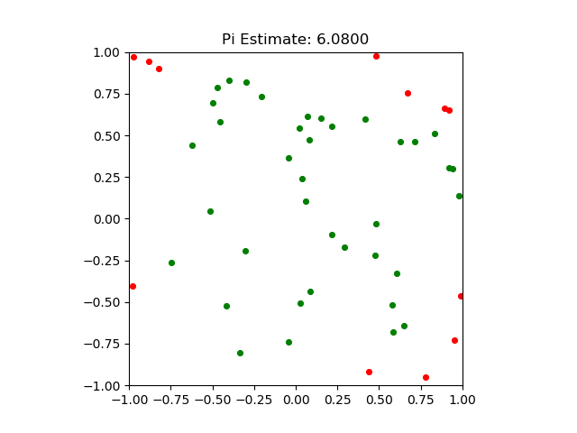

# Monte Carlo Estimation of π (pi) in Java with paralell execution using the available threads
[Based on the math found here](https://www.youtube.com/watch?v=pvimAM_SLic), this Java snippet estimates pi using a [Monte Carlo simulation](https://en.wikipedia.org/wiki/Monte_Carlo_method).

## Example

